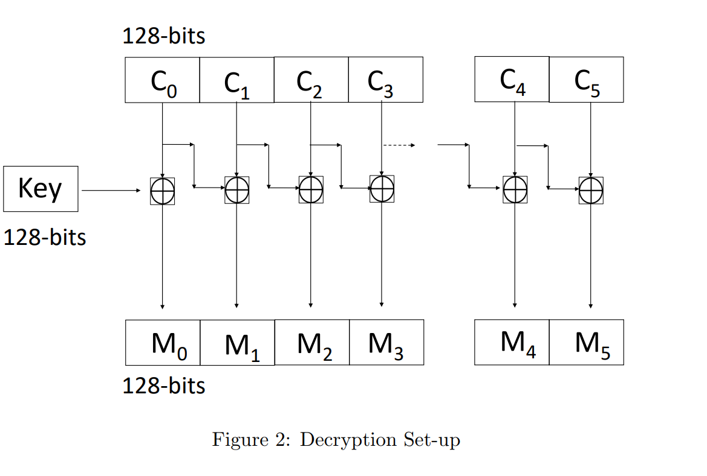

# Encryption-Decryption-Device-Linux

<b> Course Assignment for Operating Systems (CSE231) </b>  
<b> Instructor : Dr. Sambuddho Chakravarty </b>

The aim of this assignment was to create character devices for encryption as well as decryption of files. 

<b> The Encryption Device (encdev) : </b> 
The device computes a simple block cipher (encryption) on a file (the input) and outputs the encrypted file.
For this, a kernel module based device driver for the encdev device needs to be written so as to use VFS data structures and define open(), read(), write() and close() functions for this device.
The device can be accesses via a call to open() system call, passing the device file path as an argument. The first call to write() internally initializes the shared random key (a random 128-bit number). 
Subsequent write()s would result in the bytes being encrypted and stored internally in the kernel in some data structure, e.g. some dynamically allocated location. 
The last block to be written is signaled through an EOF byte being written to the file, which is not encrypted.
Subsequent read()s result in reading off the encrypted blocks, until an EOF is encountered. Finally, upon calling close(), the initialized data structures are deallocated.

<b> The Decryption Deevice (decdev) : </b> 
Just like encdev, there is a decdev device file which is used to decrement an encrypted file. Similar to encdev, there are functions like open() and write() which helps in writing blocks of encrypted file to the device. The first block of 128-bits (16 bytes) happens to be the key (the same is one used for encryption
and decryption). The subsequent blocks written are the cipher blocks (encrypted previously via the encdev). Here again the last block is signaled via the EOF character. Each of these blocks is decrypted and stored in some internal data structure.
Thereafter, subsequent read() calls result in reading blocks of decrypted blocks. The final block is again signaled through reading off the previously written EOF character.

